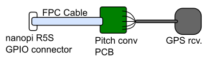

# nanopi-r5s-ptp

** This document is still under construction. **

** Currently, the PTP function of RTL8125 seems VERY unstable．Sometimes, PHC does not work correctly. Only eth0 (on-chip LAN) works fine. **

Setup nanopi R5S as a NTP/PTP server.
The OS I use here is friendlycore-focal-arm64.

## 1. Prepare hardwares



### 1.1 Buy GPS receiver

Use GPS device with serial connection, not USB connection. And the GPS device must have a 1-PPS output. The GPS receiver must be powered by 3.3v and the signal level must also be 3.3v. 

I bought this.

https://akizukidenshi.com/catalog/g/gM-12905/

By default, the serial communication speed is 9600 bps, which is a little too slow. Therefore, I have changed it to 115200 bps using u-center (u-blox tool).

### 1.2 Buy GPIO cable

12-pin 0.5mm FPC cable like this.

https://www.amazon.co.jp/dp/B09V2K1S2C

FPC connector to 2.54 mm pitch conversion PCB for soldering.

https://www.amazon.co.jp/dp/B07H2CN4TZ/

### 1.3 Assemble them

| Pin# | GPIO | UART | GPS |
| ---- | ---- | ---- | --- |
| 1 | 3V3 | | 3V3   |
| 3 | GPIO3_C3 | UART5_RX | TXD |
| 4 | GND |  | GND |
| 5 | GPIO3_C2 | UART5_TX | RXD |
|12 | GPIO3_C5 | | 1 PPS |

See below for more information of GPIO.

https://wiki.friendlyelec.com/wiki/index.php/NanoPi_R5S

## 2. Build initial image

https://github.com/friendlyarm/sd-fuse_rk3568

Clone above repository and follow it's build instructions. You need x86 cross-compile environment.

Succeeded to build a SD-Card image?

At this moment, downloading of necessary files and construction of the build environment are complete.

Okay, let's modify it for PTP.

## 3. Modify scripts for PTP support

### 3.1 Overwrite kernel configuration

Copy config/nanopi5_linux_defconfig of this repo into sd-fuse_rk3568/out/kernel-rk3568/arch/arm64/configs

### 3.2 Modify device tree

To enable UART5 and pps-gpio, modify the device tree file 'sd-fuse_rk3568/out/kernel-rk3568/arch/arm64/boot/dts/rockchip/rk3568-nanopi5-rev01.dts'.

Overwrite that file with "dts/rk3568-nanopi5-rev01.dts" of this repository.

### 3.3 Edit Makefile of R8125

Open 'sd-fuse_rk3568/out/r8125/Makefile' with editor and change PTP related lines.
```
ENABLE_PTP_SUPPORT = y
ENABLE_PTP_MASTER_MODE = y
```

## 4. Build & write SD-Card image and boot with it

```
$ sudo ./build-kernel.sh friendlycore-focal-arm64
$ ./mk-sd-image.sh friendlycore-focal-arm64
```

Boot nanopi R5S with that SD-Card. Did it boot successfully?

The following operations are performed on nanopi-R5S with the newly created SD card inserted.

## 5. Check ethernet functions

Install ethtool.

```
$ sudo apt-get install ethtool
```

Check that each LAN interface supports PTP hardware time stamping.


```
$ ethtool -T eth0
Time stamping parameters for eth0:
Capabilities:
        hardware-transmit     (SOF_TIMESTAMPING_TX_HARDWARE)
        software-transmit     (SOF_TIMESTAMPING_TX_SOFTWARE)
        hardware-receive      (SOF_TIMESTAMPING_RX_HARDWARE)
        software-receive      (SOF_TIMESTAMPING_RX_SOFTWARE)
        software-system-clock (SOF_TIMESTAMPING_SOFTWARE)
        hardware-raw-clock    (SOF_TIMESTAMPING_RAW_HARDWARE)
PTP Hardware Clock: 0
Hardware Transmit Timestamp Modes:
        off                   (HWTSTAMP_TX_OFF)
        on                    (HWTSTAMP_TX_ON)
Hardware Receive Filter Modes:
        none                  (HWTSTAMP_FILTER_NONE)
        all                   (HWTSTAMP_FILTER_ALL)
        ptpv1-l4-event        (HWTSTAMP_FILTER_PTP_V1_L4_EVENT)
        ptpv1-l4-sync         (HWTSTAMP_FILTER_PTP_V1_L4_SYNC)
        ptpv1-l4-delay-req    (HWTSTAMP_FILTER_PTP_V1_L4_DELAY_REQ)
        ptpv2-l4-event        (HWTSTAMP_FILTER_PTP_V2_L4_EVENT)
        ptpv2-l4-sync         (HWTSTAMP_FILTER_PTP_V2_L4_SYNC)
        ptpv2-l4-delay-req    (HWTSTAMP_FILTER_PTP_V2_L4_DELAY_REQ)
        ptpv2-event           (HWTSTAMP_FILTER_PTP_V2_EVENT)
        ptpv2-sync            (HWTSTAMP_FILTER_PTP_V2_SYNC)
        ptpv2-delay-req       (HWTSTAMP_FILTER_PTP_V2_DELAY_REQ)

```

```
$ ethtool -T eth1
Time stamping parameters for eth1:
Capabilities:
        hardware-transmit     (SOF_TIMESTAMPING_TX_HARDWARE)
        software-transmit     (SOF_TIMESTAMPING_TX_SOFTWARE)
        hardware-receive      (SOF_TIMESTAMPING_RX_HARDWARE)
        software-receive      (SOF_TIMESTAMPING_RX_SOFTWARE)
        software-system-clock (SOF_TIMESTAMPING_SOFTWARE)
        hardware-raw-clock    (SOF_TIMESTAMPING_RAW_HARDWARE)
PTP Hardware Clock: 1
Hardware Transmit Timestamp Modes:
        off                   (HWTSTAMP_TX_OFF)
        on                    (HWTSTAMP_TX_ON)
Hardware Receive Filter Modes:
        none                  (HWTSTAMP_FILTER_NONE)
        ptpv2-l4-event        (HWTSTAMP_FILTER_PTP_V2_L4_EVENT)
        ptpv2-l4-sync         (HWTSTAMP_FILTER_PTP_V2_L4_SYNC)
        ptpv2-l4-delay-req    (HWTSTAMP_FILTER_PTP_V2_L4_DELAY_REQ)
        ptpv2-event           (HWTSTAMP_FILTER_PTP_V2_EVENT)
        ptpv2-sync            (HWTSTAMP_FILTER_PTP_V2_SYNC)
        ptpv2-delay-req       (HWTSTAMP_FILTER_PTP_V2_DELAY_REQ)
```

```
$ ethtool -T eth2
Time stamping parameters for eth2:
Capabilities:
        hardware-transmit     (SOF_TIMESTAMPING_TX_HARDWARE)
        software-transmit     (SOF_TIMESTAMPING_TX_SOFTWARE)
        hardware-receive      (SOF_TIMESTAMPING_RX_HARDWARE)
        software-receive      (SOF_TIMESTAMPING_RX_SOFTWARE)
        software-system-clock (SOF_TIMESTAMPING_SOFTWARE)
        hardware-raw-clock    (SOF_TIMESTAMPING_RAW_HARDWARE)
PTP Hardware Clock: 2
Hardware Transmit Timestamp Modes:
        off                   (HWTSTAMP_TX_OFF)
        on                    (HWTSTAMP_TX_ON)
Hardware Receive Filter Modes:
        none                  (HWTSTAMP_FILTER_NONE)
        ptpv2-l4-event        (HWTSTAMP_FILTER_PTP_V2_L4_EVENT)
        ptpv2-l4-sync         (HWTSTAMP_FILTER_PTP_V2_L4_SYNC)
        ptpv2-l4-delay-req    (HWTSTAMP_FILTER_PTP_V2_L4_DELAY_REQ)
        ptpv2-event           (HWTSTAMP_FILTER_PTP_V2_EVENT)
        ptpv2-sync            (HWTSTAMP_FILTER_PTP_V2_SYNC)
        ptpv2-delay-req       (HWTSTAMP_FILTER_PTP_V2_DELAY_REQ)
```

## 6. Check GPS connection

Make sure that the ttyS5 and pps devices are present.

```
$ ls /dev/ttyS*
/dev/ttyS5
$ ls /dev/pps*
/dev/pps0  /dev/pps1  /dev/pps2
```

Install screen command as a comm terminal.

```
$ sudo apt-get install screen
```

If the baud rate of your GPS device is configured to 115200, then type below to check the serial port.

```
$ sudo screen /dev/ttyS5 115200
```

Do you see NMEA messages on your screen? When the GPS fixes in 3D mode (it takes more than 10 minutes), you will find latitude, longitude and altitude in the message. Then 1-PPS signal may be generated.
Press Ctrl-A then 'k' to exit.

Now install ppstool to check 1-PPS signal.

```
$ sudo apt-get install pps-tools
```

```
$ sudo ppstest /dev/pps0
trying PPS source "/dev/pps0"
found PPS source "/dev/pps0"
ok, found 1 source(s), now start fetching data...
source 0 - assert 1666260613.000000500, sequence: 19419 - clear  0.000000000, sequence: 0
source 0 - assert 1666260613.999998408, sequence: 19420 - clear  0.000000000, sequence: 0
source 0 - assert 1666260614.999997482, sequence: 19421 - clear  0.000000000, sequence: 0
source 0 - assert 1666260615.999998597, sequence: 19422 - clear  0.000000000, sequence: 0
```

If it says, "time_pps_fetch() error -1 (Connection timed out)", the 1-PPS signal is not received. Check the 1PPS signal with an oscilloscope.

## 7. Install gpsd

https://gpsd.gitlab.io/gpsd/

Note: pps and shm function must be enabled when you build the gpsd.

start gpsd.

```
$ sudo /usr/local/sbin/gpsd -n -b -s 115200 /dev/ttyS5
```

## 8. Install chrony

https://chrony.tuxfamily.org/

Before install chrony, disable timesyncd-service.

```
$ sudo systemctl disable systemd-timesyncd.service
```

Make configuration file /etc/chronyd.conf like this.

```
server ntp.nict.go.jp iburst
makestep 0.1 3
allow 192.168/16
rtcsync
noclientlog
local stratum 10

refclock PPS /dev/pps0 refid PPS
refclock SHM 0 refid GPS precision 1e-1 offset 0.05 delay 0.2

```

Start chrony
```
$ sudo /usr/local/sbin/chronyd
```

Stratum 1 NTP server is ready!

## 9. Install linuxptp

https://linuxptp.sourceforge.net/

### 9.1 Synchronize PHC to system clock

```
$ sudo /usr/local/sbin/phc2sys -r -r -s CLOCK_REALTIME -O0 -c eth1 -q -m
```

note: Example above sets time-offset (-O option) as 0. It means PHC time is UTC. But, normally, TAI is used as time in PTP, so you should specify the offset between TAI and UTC instead of 0.

### 9.2 Start PTP

```
$ sudo /usr/local/sbin/ptp4l -m -q -i eth1
```
